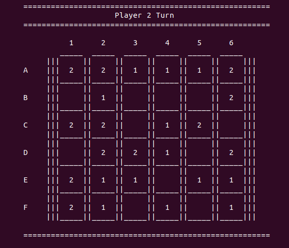

# Pathways Game - Group 5

## Group 5 - Members

| Name             | E-Mail              |
| ---------------- |-------------------- |
| Sofia Germer     | up201907461@up.pt   |
| Miguel Lopes     | up201704590@up.pt   |

## Pathways

### Setup and Install

This program was developed and tested using SICStus Prolog. Instruction on how to install SICStus can be found [here](https://sicstus.sics.se/download4.html).

To load the game consult the pathways.pl file. Finally to start the game use the **play/0** predicate:

```
| ?- play.
```

### Description and Rules

Pathway is a two player game played on a 6x6 initially empty checkerboard. The two players, Player 1 and Player 2, take turns placing their own checkers on the board, one checker per turn, starting with Player 1. Players are not allowed to pass. 

There are 2 types of connections:

- FRIENDLY CONNECTION is an adjacency between checkers from the same player.
- ENEMY CONNECTION is an adjacency between different players' checkers.

There are 2 types of placements a player can make:

- The player can place a checker to form no connections (neither friendly nor enemy). 
- The player can place a checker to form exactly one friendly connection and zero or more enemy connections.

The first player not to have an available placement wins.

Mark Steere designed Pathway in March, 2021 - Full game description [here](http://www.marksteeregames.com/Pathway_rules.pdf).

### Game Logic

#### Internal Representation

The board represents the state of the game at all times, and is used to determine and validate moves.

To implement the board, we used a list of lists. Each cell contains either:

- **a 0** to represent an empty position
- **a 1** to represent positions occupied by Player 1's pieces
- **a 2** to represent positions occupied by Player 2's pieces

The board is initialized with the predicate **initial/1**:

```pl
initial([
    [0,0,0,0,0,0],
    [0,0,0,0,0,0],
    [0,0,0,0,0,0],
    [0,0,0,0,0,0],
    [0,0,0,0,0,0],
    [0,0,0,0,0,0]
    ]).
```
The following screenshots are examples of the board at three different stages of the game:




#### Game State Visualization

The game starts with a sequence of menus which allow the user to setup the game options: if he wants to play against another person, against a bot or watch 2 bots play each other.

All display predicates are stored on the [views.pl](views.pl) file.

The main display predicates are:

-  **menu(+Board,-GameState)** this predicate is responsible for determining the game's settings, which are outputted through the GameState variable.
-  **display_game(+Board,+Player)**, this predicate displays the board, filled accordingly and the player who is currently playing.

#### Move Execution

The whole game is managed by the predicate **gameLoop/3**. This predicate is defined for each of the game possibilities: single player mode (human vs bot), multiple player mode (human vs human) and computer mode (bot vs bot).

In this section we will highlight how the moves made by the user are handled. The predicate responsible for handling the player's move is move(+Board,+Player,-NewBoard). Each time a player makes a move (a valid one), a new board is generated through this predicate.

```pl
move(Board,Player,NewBoard) :- 
    repeat,
    choose_row(Row),
    choose_column(Column),
    ((\+ valid_move(Board,Player,Row,Column))->write('Not a valid move, try again.'),nl,fail;
    replace_board_element(Board,Row,Column,Player,NewBoard),!).
```

As you can see, we use the repeat predicate to validate de user's input and check whether or not the move he wants to make is valid (the definition of what makes a move valid or not is stated in the __Description and Rules section__). If the input is valid, the **replace_board_element** predicate will create a new board with the position filled with the player's number, and if not, it will prompt the user to input a new position.

#### End of Game

A predicate to obtain a list of valid moves was developed (see next section, for more about this predicate). Since this game's winner is the last person to be able to make a move, at the beginning of each iteration of the **game_loop** predicate, we check if the current player can play - in other words, whether or not the list of valid moves is empty. This is done by the **game_over** predicate.

#### List of Valid Moves

A list of valid moves can be obtained by using the **valid_moves** predicate. This predicate tests every empty position of the current board and checks whether or not the current player can play in that position (using the **valid_move** predicate). If that position is a valid move, a list composed of 2 values [Line,Column] is appended to the list of valid moves. This list is used for detecting the end of game, and by the bots to make their game decisions. The predicates referenced in this section are located in **logic.pl** file, as well as all predicates related to the game's logic.


#### Evaluation of the Game State

After much reflection we concluded that in our particular scenario, this function wouldn't actually offer any new information, since our game can't be quantified at a particular stage. Since the winner isn't defined by how many pieces he is able to place, or any quantifiable measure, but by their strategic thinking, it would be very hard for us to define at a given point in time who is in a better state.

#### The Game Bots

As proposed we defined a game mode where bots participated (the **single player mode** or the **bot versus bot mode**). To do this we defined two predicates to decide the next move:

- the **random_move** predicate, used for both levels of intelligence. This predicate simply picks a random move from the list of valid moves mentioned earlier.
- the **smart_move** predicate, used only in the highest level of intelligence. This predicate first checks whether there is a smart move to be made, and if there isn't it chooses the random move mentioned before. A smart move is a move that occupies a position that is available for both players, hence reducing the opponent's number of possible plays and increasing the likelihood of the bot winning.

### Conclusions

This project was very enriching, since we are typically used to working with imperative programming languages and this forced us to change or thought process and rethink some of our preconceptions on how to approach a problem.

### Bibliography

- Class provided materials
- [Pathways rules, Mark Steere ](http://www.marksteeregames.com/Pathway_rules.pdf)
